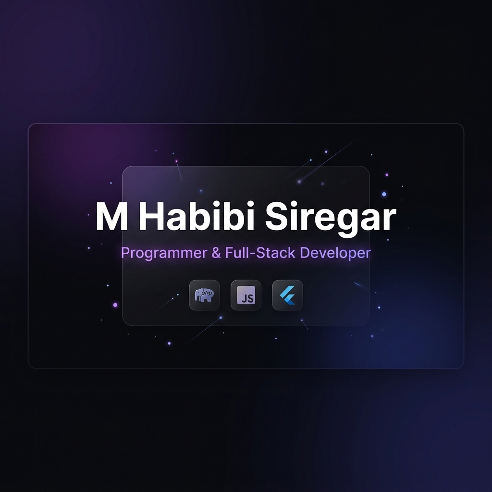

# M Habibi Siregar — Developer Portfolio

A sleek, modern, and highly responsive personal portfolio website built using Vite and Vanilla HTML, CSS, and JS. Designed to showcase projects, skills, and experience with a polished, interactive user interface.



## ✨ Features

- **Modern UI/UX**: Glassmorphism elements, CSS animations, typing effects, and smooth scrolling.
- **Dynamic Content**: Profile data, skills, and projects are managed effortlessly using a JSON-based architecture.
- **Serverless Contact Form**: Integrated with [Web3Forms](https://web3forms.com/) and protected by hCaptcha for secure, email-direct messaging without the need for a backend.
- **Floating Music Player**: Integrated background music player with volume control and interactive equalizer animations.
- **SEO Optimized**: Complete with OpenGraph tags, modern meta info, XML sitemaps, and strict JSON-LD structured data for better search engine indexing.
- **Automated Deployment**: Custom continuous deployment workflow via GitHub Actions pushing changes seamlessly to GitHub pages on a custom domain.

## 🚀 Tech Stack

- **Frontend core**: Vanilla HTML5, CSS3, JavaScript (ES6+).
- **Build tool**: [Vite](https://vitejs.dev/) for extremely fast Hot Module Replacement (HMR) and optimized builds.
- **Deployment**: GitHub Pages via GitHub Actions workflow.

## 🛠️ Getting Started

To run this project locally, follow these steps:

### 1. Clone the repository

```bash
git clone https://github.com/Kyra-Code79/static-portfolio.git
cd static-portfolio
```

### 2. Install dependencies

```bash
npm install
```

### 3. Setup Environment Variables

Create a `.env` file in the root directory and add your Web3Forms access key to enable the contact form functionality:

```env
VITE_WEB3FORMS_KEY=your_web3forms_access_key_here
```

### 4. Run the development server

```bash
npm run dev
```

Open your browser and visit the URL displayed in the terminal (usually `http://localhost:5173`).

## 📦 Building for Production

To create a production-ready build, run:

```bash
npm run build
```

The optimized static files will be generated in the `dist` directory.

## 📄 License

This project is personal portfolio code. Modifying and reusing it is permitted, but please make sure to replace the personal information and photos with your own before publishing.

**Music Note:** The background music track ("Jazz Lounge") is sourced from Pixabay under their terms of use for free stock audio and credited to [SigmaMusicArt](https://pixabay.com/users/sigmamusicart-36860929/).
